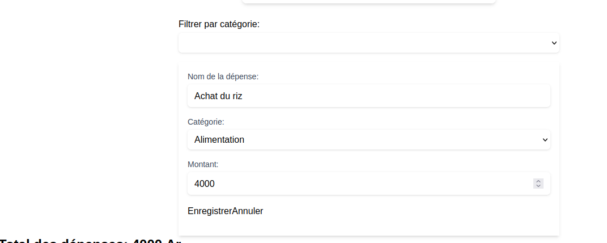

#Gestion des dépenses personnelles

    ## Présentation du projet
Gestion des dépenses personnelles est une application web développée dans le cadre d'un projet universitaire en Licence 2 Génie Logiciel.

Elle permet aux utilisateurs d'enregistrer et de gérer leurs dépenses quotidiennes grâce à une interface simple et intuitive.

Le projet est réalisé en équipe avec Vue.js 3 et Vite.

    ##Objectifs
-Faciliter l'enregistrement des dépenses personnelles
-Organiser les dépenses par catégorie
-Calculer automatiquement le montant total des dépenses
-Permettre la gestion des dépenses à travers une interface simple
-Mettre en pratique les composants Vue.js et le travail collaboratif avec Git et GitHub

    ##Technologie utilisées
-Vue.js 3
-Vite
-JS
-HTML5
-CSS3
Git et GitHub
-LocalStorage pour la sauvegarde locale des dépenses

    ##Fonctionnalités
-Ajouter une dépense avec un titre, une catégories et un montant
-Afficher la liste des dépenses
-Calculer auto le total des dépenses
-Sauvegarder les dépenses dans le navigateur avec localStorage
-Conserver les modifications après actualisation de la page
-Modifier une dépense
-Filtrer les dépense par catégorie
-Finaliser l'ensemble des composants de l'application

    ##Installation et lancement

        ##Prérequis
    -Node JS
    -Npm
    -Git

        ##Installation
    Cloner le depôt:
        gt clone https://github.com/lucasnov210-del/L2-gl-2026-groupe-04-gestion-depenses.git

    Entrer dans le dossier du projet:
        cd L2-gl-2026-groupe-04-gestion-depense
    
    Installer les dépendances:
        npm install

    Lancer le serveur de developpement:
        npm run dev
        Ouvrir ensuite dans le navigateur l'adresse locale indiquée par Vite dans le terminal
    
    ##Equipe du projet

    Projetréalisé en groupe dans le cadre de la Licence 2 Génie Logiciel
    
    Membre                              Mission principale
    lucasnov210-del                     Integration générale + coordination     

    Brunah-Em                           Suppression d'une dépense

    Tianjara-dev                        Filtre par Categorie

    Andry-rl                            Ajout d'une dépense

    Rakotonandrasanajojo405-oss         Modification d'une dépense

    Lucia303                            Liste des dépenses

    nilsenthemie22                      Total/statistiques + documentation

    maricettezafy-max                   README + test/scénarios + documentation

 N° | Nom et prénoms | N° d'inscription |

|----|----------------|------------------|

| 1 | RAZAFINDRAVINA Lucia | 13ISST24-1707FGCI/Ginfo |

| 2 | ZAFY MARICETTE Romuna | 13ISST24-1572FGCI/Ginfo |

| 3 | TIANJARA Wendy Géraldo | 12ISST23-1407FGCI/GInfo |

| 4 | TSARALAZA Luciano Carlos | 11ISST22-1080FGCI/Ginfo |

| 5 | Rakotonandrasana Jojo | 13ISST24-1538FGCI/GInfo |

| 6 | TAHIANJANAHARY Rolland Andry | 13ISST24-1800FGCI/Ginfo |

| 7 | RAVELONANDRASANA Themie Nilsen | 13ISST24-1822FGCI/Ginfo |

| 8 | HANITRINIAINA Emelia Brunah | 13ISST24-1743FGCI/Ginfo |

| 9 | Rakotonindrina Deraina Mamihasina Sylvio | 13ISST24-1723FGCI/GInfo |

| 10 | VELONDRAZANA Fazilah | 13ISST24-1578FGCI/GInfo |

| 11 | RANAIVOJAONA Bridgette Elysia | 13ISST24-1583FGCI/GInfo |

| 12 | RAKOTOMANGA Maminiaina Jedidia | 13ISST24-1653FGCI/GInfo |

| 13 | RAZAFIMANDIMBY Franthony | 13ISST24-1731FGCI/GInfo |

    ##Orgranisation du projet
        src:/
            components/
                ListerExpense.vue
                SupprimerExpense.vue
                FiltrerExpense.vue
                ModifierExpense.vue
        App.vue
        main.js
        style.css

    ##Collaboration
    Le projet utilise Git et GitHub pour permettre aux membres de trvailler sur des branches distinctes

    Les modifications sont vérifiées avant leur intégration dans la branche principale

    
    ##Captures d'ecran
    Des captures d'écran de l'application 

    ##Formulaire d'ajout
    ![Formulaire d'ajout] (./public/AjoutExpense.png)

    ##Liste des dépense
    ![Liste des dépenses] (./public/ListeExpense.png)

    ##Modification d'une dépense
    

    on a mis les total et filtrer dans App.vue

    ##Licence 
    Projet universitaire réalisé à des fins pédagogiques
